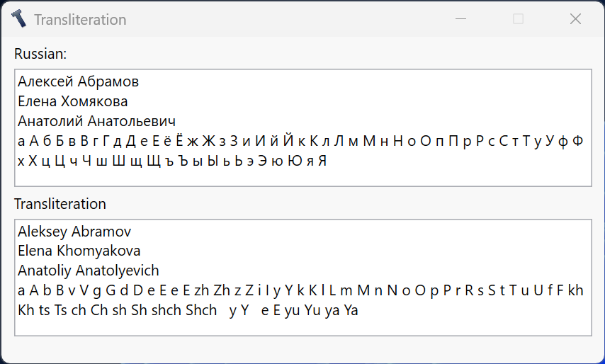

# Translit
Simple app for transliterate russian text to english.

а=>a, б=>b, в=>v, г=>g, д=>d, е=>e, ё=>e, ж=>zh, з=>z, и=>i, й=>y, к=>k, л=>l, м=>m, н=>n, о=>o, п=>p, р=>r, с=>s, т=>t, у=>u, ф=>f, х=>kh, ц=>ts, ч=>ch, ш=>sh, щ=>shch, ъ=>, ы=>y, ь=>, э=>e, ю=>yu, я=>ya

# Installation
Not reqired.

# Usage
Just write text in first text box and take from second.

# Technologies
WPF (.NET Framework 4.6)

# Authors
Aleksey Abramov

# License
MIT

# Project Status
Complited

# Demo

